# Setup instructions
To setup this proyect, there are mainly 4 steps involved:
1. Install Java1.8
2. Lombok setup
3. Configure mysql
4. Configure Eclipse

**Note: This setup has been performed and tested on Ubuntu18.04**

## Install Java1.8
For this proyect, Java1.8 is needed.
To check the current default version of java we can use:
```
java -version
```
Depending on the version we have installed, the output will be as follows:

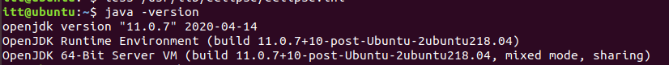

If the default version is openjdk 1.8, proceed to the next step.

To check for other installations of java (on the default directory), we can use:
```
ls /usr/lib/jvm
``` 
In our case, the output is as follows:

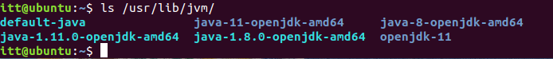

If java-8-openjdk-8-amd64 is present, proceed to the next step.

If java 1.8 is not already installed, we can install it with the a
pt-get package manager:
```
sudo apt-get update
sudo apt-get install openjdk-8-jdk
```
If the installation finished successfully, proceed to the next step.

## Lombok setup
In this setup, we will use [Eclipse](https://www.eclipse.org/), so [Lombok](https://projectlombok.org/) 
needs to be installed into it (for annotation preprocessing).

First, we need to download lombok:
```
wget https://projectlombok.org/downloads/lombok.jar -O /tmp/lombok.jar
```

Then, we need to install in into eclipse:
```
sudo java -jar /tmp/lombok.jar
```

This will open a GUI as follows:

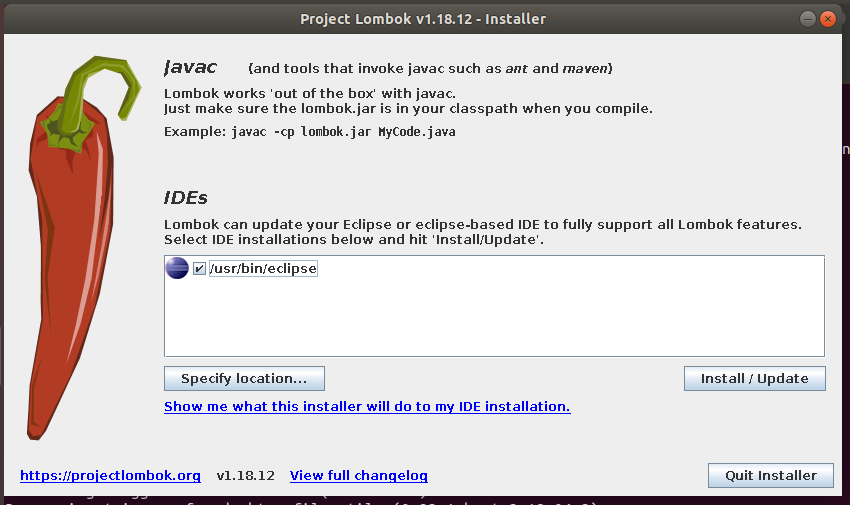

In this GUI, we should select the Eclipse installation which we will use
(in our case, it is already selected), and click on 'Install/Update'.

If the installation was successful, the following message will be shown:

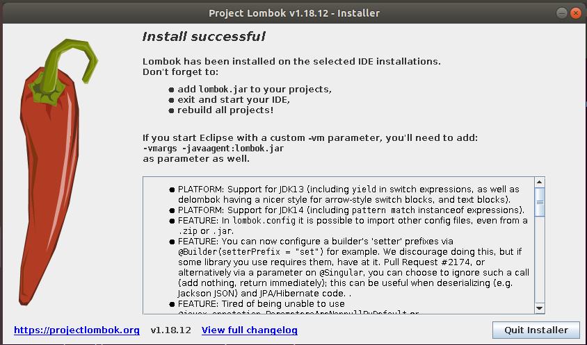

After this, we can quit the installer and proceed to the following step.

## Mysql setup
In this proyect, the datasource used for the spring application will be
a mysql database. We will assume a mysql database is already installed
and available on localhost. If this was not the case see [install mysql-server](https://ubuntu.com/server/docs/databases-mysql).

First, we need to connect to our mysql-server.
After we are connected, we need to create the database used in by application:
```
create database db_guardians;
```

Then, we will create the user of the application (note the given 
password is solely used for developing, and should be changed in 
production):
```
create user 'springuser'@'%' identified by 'CatChairShowShoe';
```

Finally, we have to grant the needed privileges to this used. Again, note
all privileges are grantes for developing purposes. In production, only
select, insert, update and delete privileges should be granted:
```
grant all on db_guardians.* to 'springuser'@'%';
```

After this setup has been correctly completed, proceed to the next step.

## Eclipse setup
As metioned above, Eclipse will be the IDE used in this proyect. If any
other IDE is used, not only this step, but the lombok setup might not be
valid.

To setup Eclipse, there are three steps involved:
1. Import the proyect
2. Configure the Java Build Path
3. Build the proyect

### Import the proyect
To begin with, we need to clone the repository (note we will be storing 
the repository in \~/Documents/guardians):
```
git clone https://github.com/miggoncan/guardiansRESTinterface ~/Documents/guardians
```

Now, we need to open eclipse. After we have selected the desired workspace
(in this example, we will use the default workspace), we have to import
the proyect. This can be easily done from the package explorer in the
JavaEE perpective:

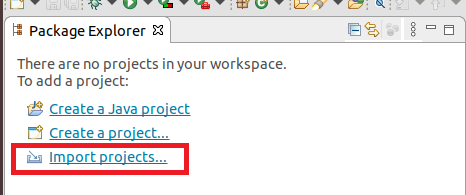

Now we have to import the proyect using Maven:

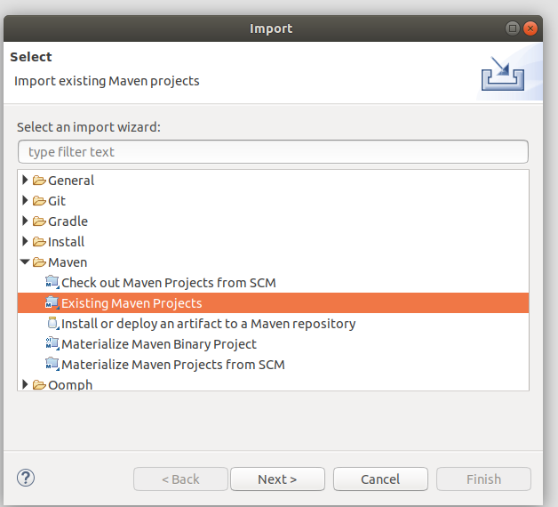

After cliking on next, the following window should appear:

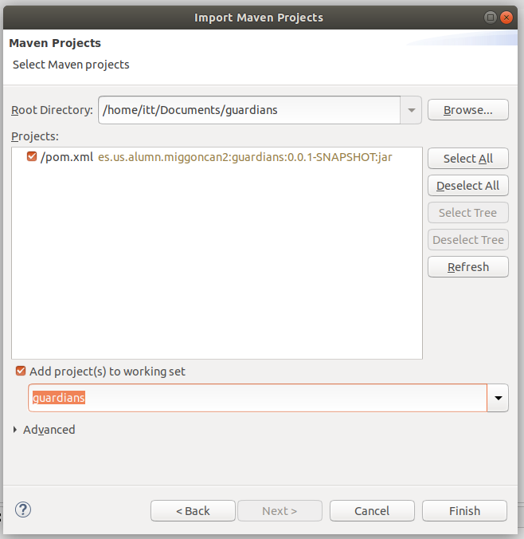

As in the image above, we have selected the proyect folder (in our case,
/home/itt/Documents/guardians), and ticked the box to import the proyect
to the working set.

When we click on finish, the proyect will start to get imported. Note 
this process may take a while. A progress bar as follows will show on the
bottom left corner:

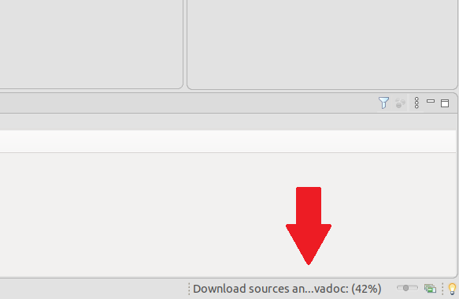

After the proyect has been successfully imported, proceed to the next step.

### Configure the Java Build Path
As we saw in the Install Java1.8 section, our current default java version
is Java11. Therefore, we need to configure the Java Build Path to use
the 1.8 version.

If the current java version used in the proyect is not the needed one,
we will see a warning as follows in the Markers window:

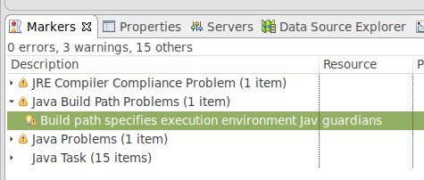

To fix it, we need modify the proyect properties:

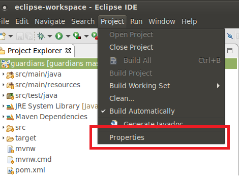

After the properties window is opened, we need to navigate to 'Java Build Path'
and select the 'Libraries' tab. Here, we select the current java library
in use and remove it:

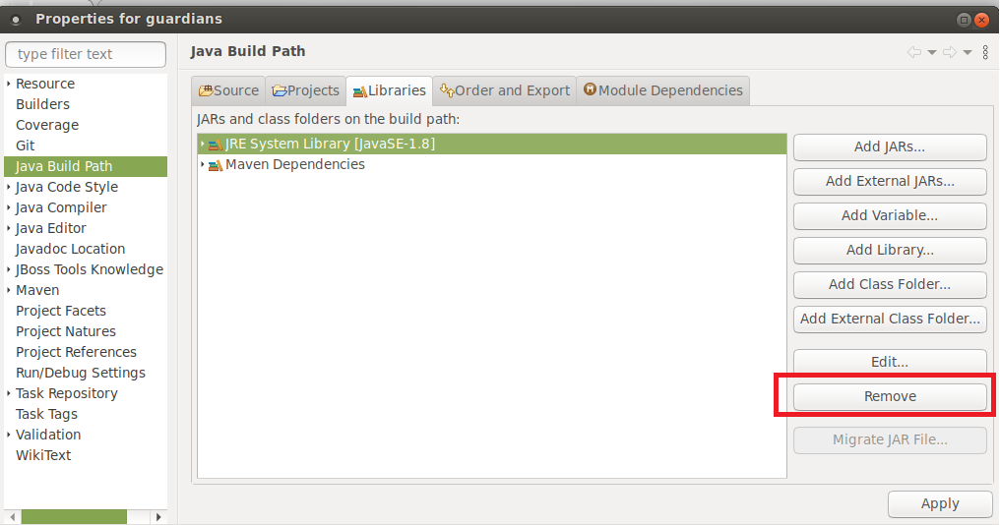

Then, we have to add the openjdk-8 library:

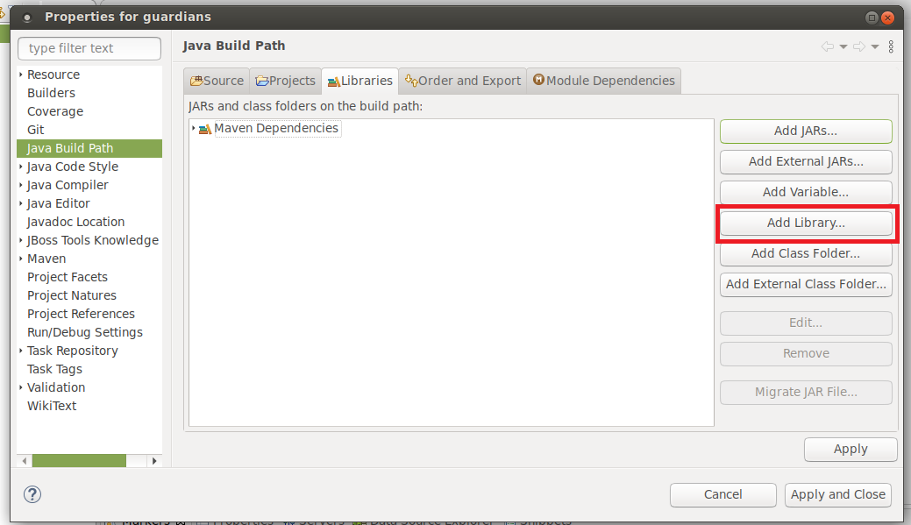

We have to select 'JRE System Library':
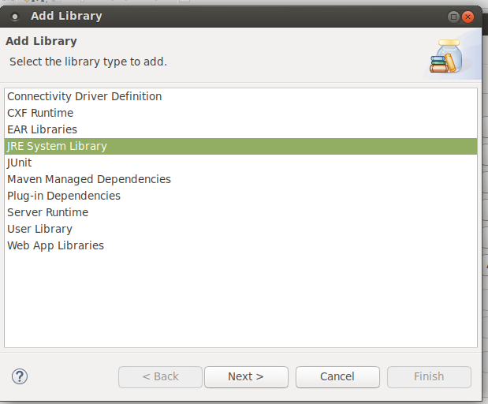

Then, then follwing window will pop up:

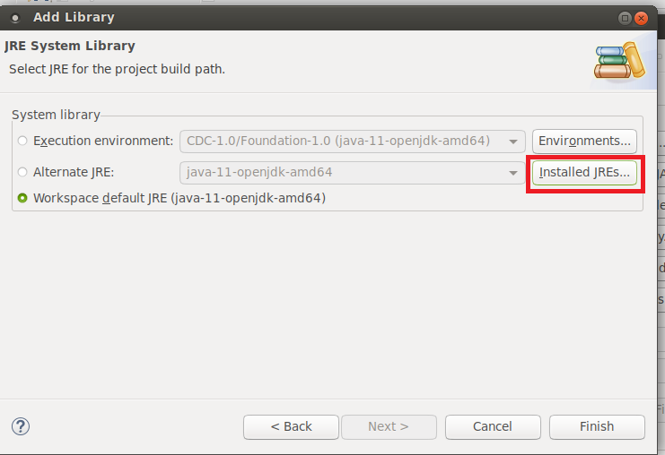

In this window, we have to click on 'Installed JREs...', and the following
window will appear:

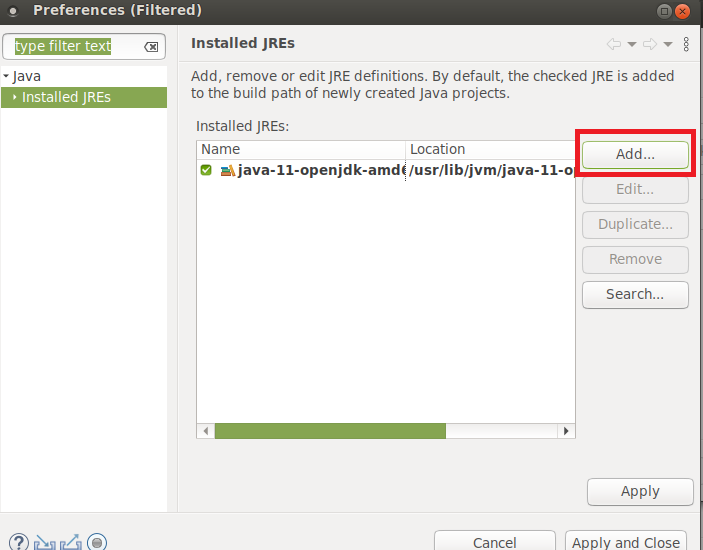

We have to click on 'Add', select 'Standard VM' and click on next:

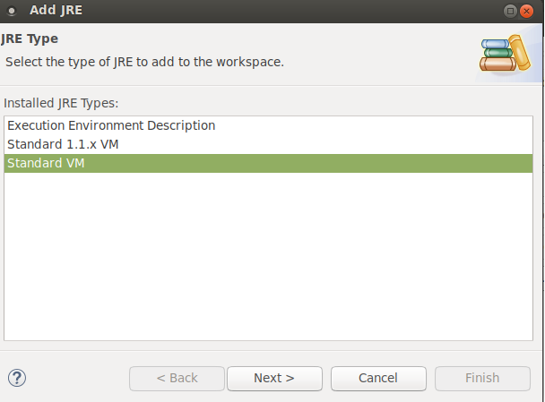

After this, the following window will appear, and we will have to select
the directory in which openjdk-8 is installed:

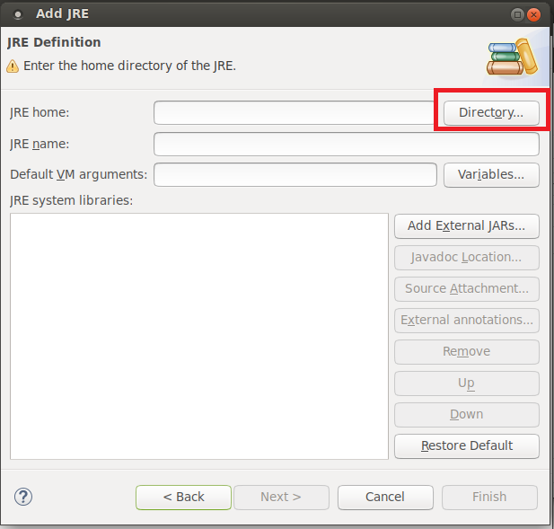

In our case, as show in the Install Java1.8 section, this is:

/usr/lib/jvm/java-8-openjkd-amd64/bin

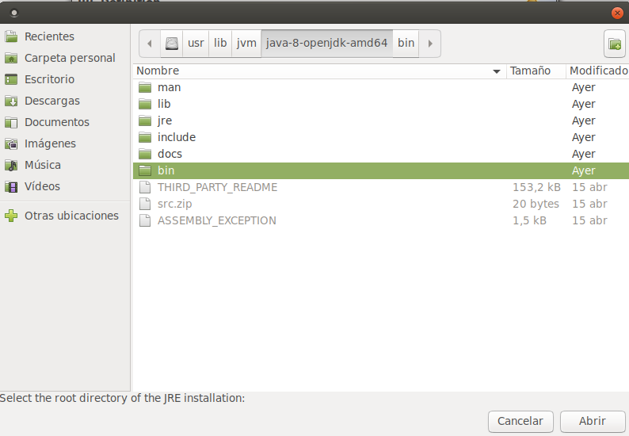

After we have selected the java directory, we have to click on 'Finish':

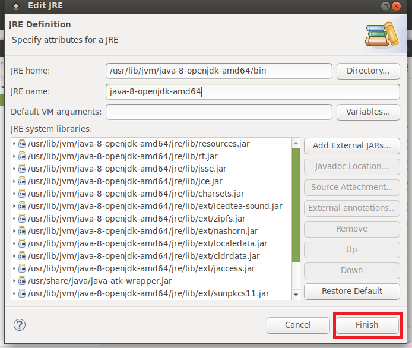

Now, we can select the JRE we have added:

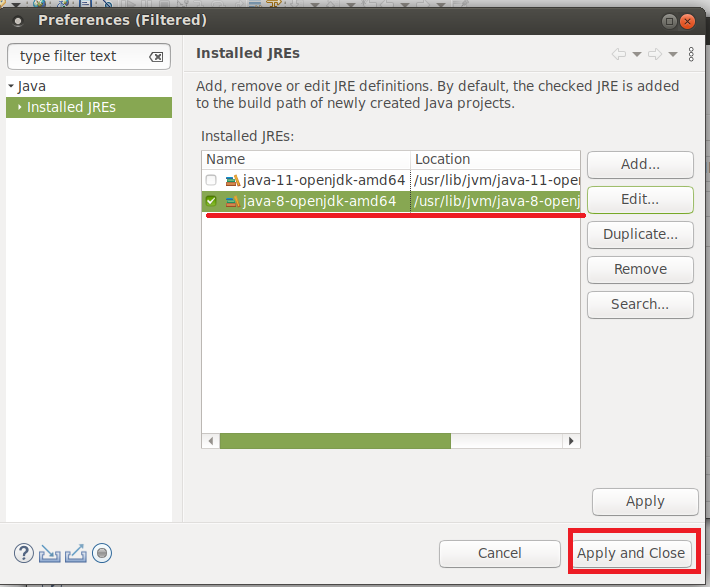

We will see the new workspace default JRE is java-8-openjdk-amd64. So 
we click on finish:

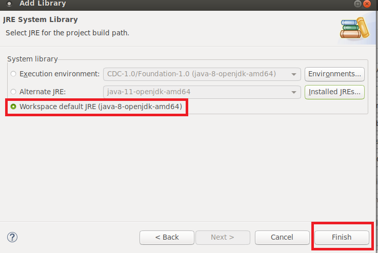

Lastly, we can apply the changes:

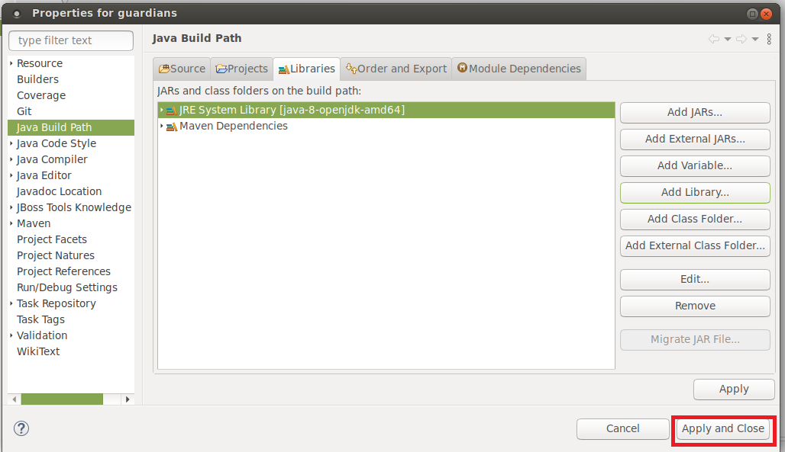

If everything was configured correclty, we should see the warning from
'Markers' has dissapeared, so we can proceed with the next step.

### Build the proyect
Lastly, we can update the proyect dependencies using Maven by right clicking
on the pom.xml file, Maven->Update Proyect:

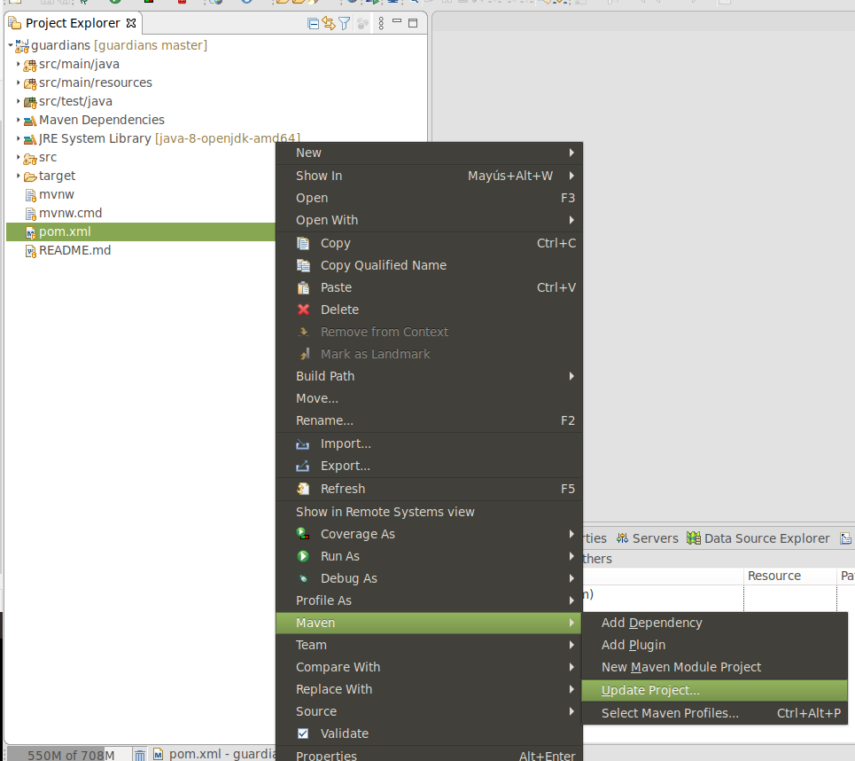

A window will pop up, and we click on ok:

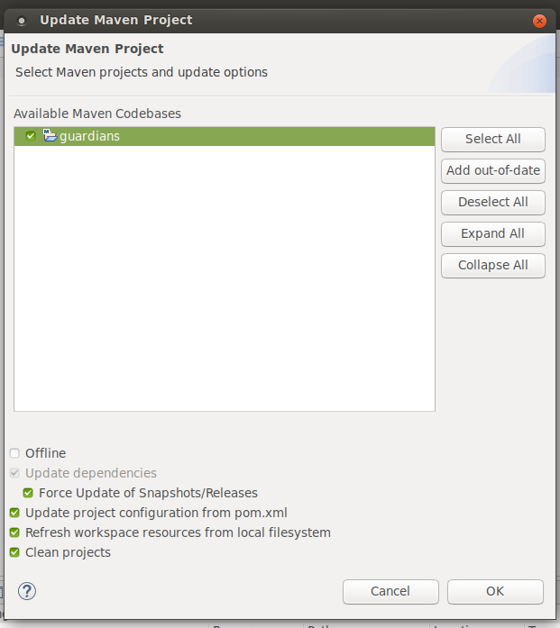

After the dependencies have been updated, we should be able to start the
server through the main entry point: 'GuardiansApplication.java'.
To do this, right click on the file, and select Run As->Java Application:

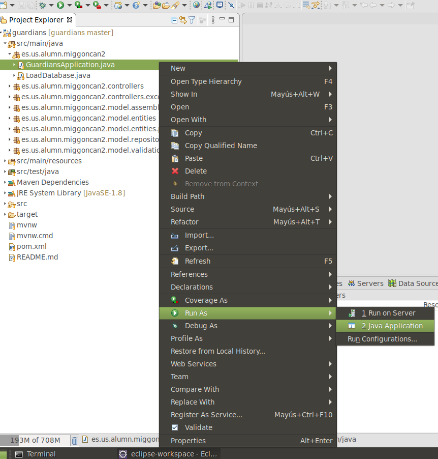

After this, we should see the output of our application in the 'Console' window.
